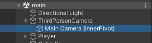
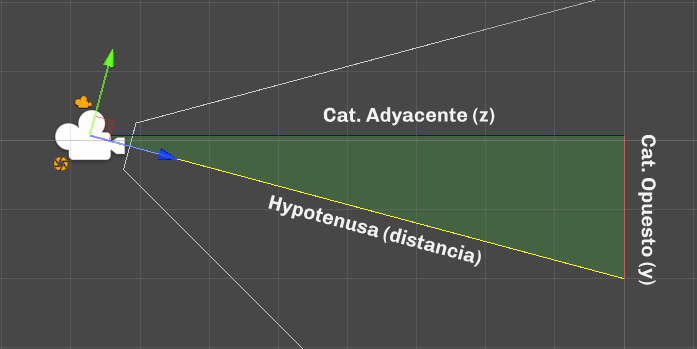
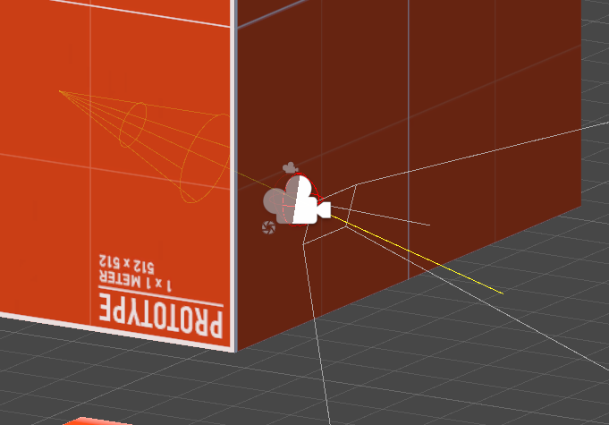
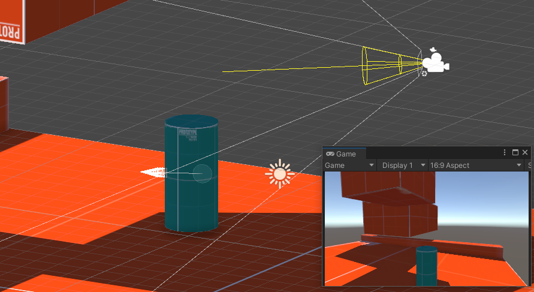

# Third Person Camera
`using ChocoDark;`

Controlador de camara en 3ra persona con wall-clipping, seguimiento de objetivo y rotacion por mouse.

## Seguimiento de objetivo
El controlador moverá su centro para coincidir con la posición del objetivo que se le asigna en la propiedad 'FollowTarget'.
```csharp
Transform FollowTarget
```
Podemos ajustar la velocidad con la que el controlador se mueve utilizando la propiedad 'FollowSpeed'.
```csharp
float FollowSpeed
```
Disminuir este valor provoca un movimiento más **suave** pero lento.
Por el contrario, aumentar este valor provoca que el movimiento sea más **instantáneo**.

## Pivote interno (InnerPivot)
Objeto que se utiliza como punto de referencia para mover, rotar y alejar la cámara.
Debe ser hijo del controlador y puede ser la cámara misma.  


## Desplazar el pivote interno
Para obtener un foco de orientación deseado de la cámara, buscaremos desplazar el pivote interno.
Este objeto será desplazado por el controlador, por lo que **no es posible desplazarlo manualmente**. En su lugar, se debe **utilizar** la propiedad 'InnerPivotOffset' en el inspector.
```csharp
Vector3 InnerPivotOffset
```
El controlador no rota este objeto, así **podemos rotarlo manualmente** sin problemas.
Este desplazamiento se aplica luego de calcular la distancia y posición del pivote.

## Distancia del pivote interno
La distancia de la cámara se determina considerando su rotación en el eje X.
```csharp
float MaxInnerPivotDistance
float InnerPivotDistance
```
La posición de la cámara se obtiene mediante el cálculo de un triángulo rectángulo, en el cual la hipotenusa representa la distancia deseada. Los catetos del triángulo corresponden a la altura en el eje Y (cateto opuesto) y al desplazamiento en el eje Z (cateto adyacente), tomando en cuenta el ángulo de rotación en el eje X del pivote.  

La cámara **siempre** se desplaza sobre la recta de la hipotenusa.

## Detección de obstaculos (Wall-clipping)
Se realiza un raycast desde el vértice opuesto de la recta que forma la hipotenusa del InnerPivot y hacia la parte trasera, detectando todos los objetos con un collider detrás de la cámara.
Se identifica el objeto más cercano y se establece la distancia del impacto como la nueva distancia del InnerPivot.  
En caso de que no se detecten obstáculos, se utiliza la distancia máxima por defecto 'MaxInnerPivotDistance'.  


## Rotación por mouse
```csharp
RotateByDelta(Vector3 deltaRotation)
```
Aplica una rotación al controlador con el vector que reciba; la rotación se aplica instantáneamente en el frame en que se llama a esta función.
Cada llamada agrega y aplica la rotación recibida. Por ejemplo, si le pasamos el valor (1,0,0), **en cada llamada rota 1°** (grado), por eso el valor debe ser delta.

El controlador puede tomar los inputs del mouse y hacer la rotación automáticamente; para habilitar esta funcionalidad se debe activar la propiedad 'EnableMouseRotation'. La sensibilidad se ajusta con 'MouseSensitivity'.
```csharp
bool EnableMouseRotation
float MouseSensivility
```
La propiedad 'LockMouse' bloquea y oculta el mouse en el centro de la pantalla.
```csharp
bool LockMouse
```


## Obtener orientacion de la camara
```csharp
ProjectOnForward(Vector3 localDirection)
```
Proyecta la dirección dada (localSpace) sobre el forward del controlador, y la devuelve en worldSpace.  

Es útil para mover objetos, como el personaje, con inputs de teclado basados en la orientación de la cámara. 